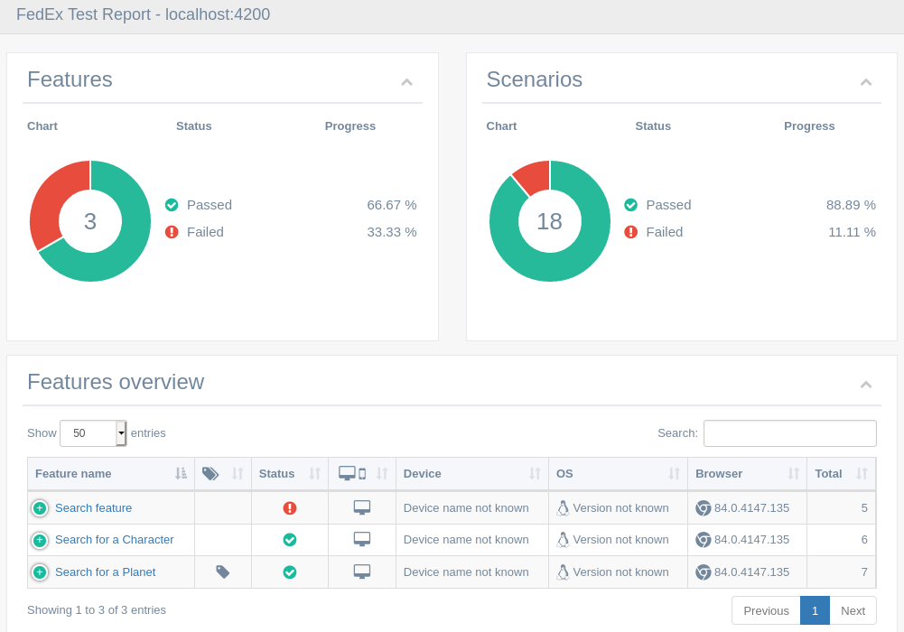

# QA Engineer Assessment Solution

## Introduction

[GitHub](https://github.com/nextlevelbeard)

[LinkedIn](https://www.linkedin.com/in/sudoricardobarbosa/en)

Hello, I'm Ricardo and this is my solution for the challenge.
Spoke to Arpan about the possibility of building a solution using webdriverIO instead of protractor and after the go-ahead, came up with this.
I based this solution on a boilerplate I've been working for some time.


#### Folder structure
- /
    - [.idea](.idea) - Run configuration for your convenience
    - [.run](.run) - The folder aggregating the latest test run artifacts
        - [features](.run/features) - Running in parallel mode will split scenarios into feature files, they are store here
        - [logs](.run/logs)
            - [wdio.log](.run/logs/wdio.log) - Main process log file
        - [reports](.run/reports)
            - [allure](.run/reports/allure) - Historical Allure report
            - [cucumber](.run/reports/cucumber) - Latest run [Multiple Cucumber](https://github.com/wswebcreation/multiple-cucumber-html-reporter#readme) test report
        - [results](.run/results)
            - [allure](.run/results/allure) - Allure XML results
            - [json](.run/results/json) - Cucumber JSON results
            - [visual](.run/results/json) - Visual regression test results
        - [shots](.run/shots) - Screenshots are stored here
    - [src](src) - Contains the app
    - [tests](tests) - Base tests folder, contains E2E and visual tests
        - [e2e](tests/e2e)
            - [components](tests/e2e/components)
            - [configs](tests/e2e/configs)
            - [features](tests/e2e/features)
            - [pages](tests/e2e/pages)
            - [services](tests/e2e/services)
            - [steps](tests/e2e/steps)
            - [utils](tests/e2e/utils)
        - [visual](tests/visual)
            - [configs](tests/visual/configs)
            - [snapshots](tests/visual/snapshots)
        - [base.conf.js](tests/base.conf.js) - Base configuration for tests E2E or not
    - [docker-compose.yml](docker-compose.yml) - A Docker compose file to bring up a local [Zalenium](https://opensource.zalando.com/zalenium/) grid

#### Bootstrapping

As per assessment, use Node 10 for the app.
My custom webdriverIO-based project however needs at least Node 12 LTS. The app also does not seem to mind it.
So my recommendation is to go with Node 12 LTS.
If you're running `nvm`, you can simply run:
```shell script
# nvm install 12
nvm use 12
```
Install the dependencies
```
npm install
```
There are several options to run the tests as highlighted by this table:

|  Description | Automation Protocol | npm scprit  | Configuration file |
|---|---|---|---|
| On the local machine with CDP / Pupeteer  | Chrome Devtools Protocol | `test:e2e:local` | [local.conf.js](tests/e2e/configs/local.conf.js)  |
| On the local machine with Selenium Grid   | webdriver                | `test:e2e:grid`  | [grid.conf.js](tests/e2e/configs/grid.conf.js) |
| Against a local (or remote) Zalenium Grid | webdriver                | `test:e2e:zal`   | [zalenium.conf.js](tests/e2e/configs/zal.conf.js) |
| Against BrowserStack                      | webdriver                | `test:e2e:bs`    | [bs.conf.js](tests/e2e/configs/bs.conf.js)  |

> You can combine these options with parallel mode which will spin up a browser instance per Scenario instead of per feature file (capped at a maximum of 4 as per [tests/base.conf.js](tests/base.conf.js)).
>


|    |            |
|----------|:-------------:|
|  |_Too many options? Use an IntelliJ IDE and pick a run configuration that was provided with the project._ ||

By default, all the tests run with the first option and go against 2 browsers: Chrome and Firefox.
To invoke this type of test run, simply execute:
```shell script
npm run test:e2e:local
```
If you want to specify which browser (and this is valid for all test run options) use `--browserName` as such:

```shell script
npm run test:e2e:local -- --browserName chrome
```
> ```shell script
> npm run test:e2e:local -- --browserName firefox
> ```
> 
> To run Firefox via Chrome Devtools Protocol you need [Firefox Nightly](https://www.mozilla.org/nl/firefox/channel/desktop/) and
  to specify the binary path in [local.conf.js](tests/e2e/configs/local.conf.js). [Oh and have "nightly" in the that path](https://github.com/webdriverio/webdriverio/pull/5528/files#diff-cce01ca3db8de5ff8a2dfcbb95dc732aR133).


#### Problems faced

- In the provided protactor-based boilerplate, the globing pattern for the .feature files was missing.
Tests obviously would not run.
Fixed by editing [protactor.conf.js](protractor.conf.js), replacing:

    ```./e2e/features/*/*.feature```

     with

     ```./e2e/features/**/*.feature```


- In the provided protactor-based boilerplate, I could not run the tests without first correcting protactor's Cucumber
framework configuration. I've tried simply changing the `framework` from `custom` to `cucumber` but more changes
were necessary as per the [documentation](https://www.protractortest.org/#/frameworks):

    > Note: Cucumber is no longer included by default as of version 3.0. You can integrate Cucumber with Protractor with the custom framework option. For more information, see the Protractor Cucumber Framework site or the Cucumber GitHub site.
    > If you would like to use the Cucumber test framework, download the dependencies with npm. Cucumber should be installed in the same place as Protractor - so if protractor was installed globally, install Cucumber with -g.
    > ```json
    > framework: 'custom',
    > frameworkPath: require.resolve('protractor-cucumber-framework')
    > ```

- Running the tests was failing due to a missing `tests-reports` folder in the `qa-tests-assessment-master` base folder.
Creating this folder solves the problem, perhaps this step should be part of the setup.

#### Approach

##### `data-test` attributes

Since it was specified modifying the app was an option, I've added `data-test` attributes to some important components
 and static elements. My reasoning for this is the based on the common justification for using this convention:
 - It anchors important elements and removes this burden from other properties like the `id` attributes and CSS classes
 which are heavily linked to functionality and style and are therefore prone to change.
 - Allows for a more readable and overall more (application) conforming Page Object design.

For the [App](src/app/app.component.html) component:

- **_app-loading_** - For the loading element, important to assess whether the app is in an expectation-ready state
- **_app-notfound_**- For the root element

For the [Planet](src/app/components/planet/planet.component.html) component:

- **_planet_**
- **_planet-name_**
- **_planet-population_**
- **_planet-climate_**
- **_planet-gravity_**

For the [Character](src/app/components/character/character.component.html) component:

- **_character_** - For the root element
- **_character-name_**
- **_character-gender_**
- **_character-year_**
- **_character-eye_**
- **_character-skin_**

For the [SearchForm](src/app/components/search-form/search-form.component.html) component, `search-form` at the root.

#### Reporting

There are two reports you can browse.

##### Allure


If it was not done autocatically, you can generate the report after a test run with
```javascript
npm run report:generate
```
You can then serve and open it by
```javascript
npm run report:open
```

##### Multiple Cucumber


You should be provided a link to the automatically generated HTML file after the test run.
Either way, the last run report always kept in [here](.run/reports/cucumber/index.html).

#### Remarks

- There is a bit of code being reused among the Planet-focused and Characters-focused step implementations.
 Figured it was more important to show proper separation of concerns and not have
 big, do-it-all Frankestein-monster steps :)

     As a practical example of this design choice, in [search.steps.js](tests/e2e/steps/search.steps.js) there is a generic
     step to assess if any search result is present:
     ```javascript
    Then(/^I should( not)? see any search results$/i, shouldNot => {

        homePage.loadingMsg.waitForDisplayed({ reverse : true });

        const { Characters, Planets } = homePage;

        const displayedResults = [Planets, Characters]
            .flat()
            .filter(c => c.container.isDisplayed())
            // Better assertion output on failure
            .map(r => r.asModel);

        shouldNot ?
            expect(displayedResults).toHaveLength(0) :
            expect(displayedResults.length).toBeGreaterThan(0);
    });
    ```

    In which the keyword's regular expression, logic and assertion could be changed to accommodate not only generic
    search results but also only Characters and only Planets. Would increase a bit the complexity of the step, making it
    more difficult to maintain and read while also breaking this separation of concerns principle.
    In this step implementation, we could easily iterate on it to add other possible categories easily like
    [Starships](https://swapi.dev/documentation#starships) by adding a `Startships` page component to the array of
    component lists we consider search results, something like

    ```javascript
        const displayedResults = [Planets, Characters, Starships]
    ```

    Because of these reasons, I'd rather reuse a bit of code/logic in these two extra steps:

    - [people.steps.js](tests/e2e/steps/people.steps.js):
         ```javascript
        Then(/^I should( not)? see a list of (?:people|characters)$/i, notSee => {
            homePage.loadingMsg.waitForDisplayed({ reverse : true });
            const displayedCharacters = homePage.Characters.filter(p => p.container.isDisplayed().map(r => r.asModel));
            notSee ?
                expect(displayedCharacters).toHaveLength(0) :
                expect(displayedCharacters.length).toBeGreaterThan(0);

        });
        ```
    - [planets.steps.js](tests/e2e/steps/planets.steps.js):
        ```javascript
        Then(/^I should( not)? see a list of [pP]lanets$/i, notSee => {
            homePage.loadingMsg.waitForDisplayed({ reverse : true });
            const displayedPlanets = homePage.Planets.filter(p => p.container.isDisplayed().map(p => p.asModel));
            notSee ?
                expect(displayedPlanets).toHaveLength(0) :
                expect(displayedPlanets.length).toBeGreaterThan(0);
        });
        ```

- Fixed a problem I created, made the mistake of writing some tests where I was destructuring the page and
 therefore querying the DOM before making the wait for the loading message to disappear

```javascript
// Mistakenly evaluating the Characters before waiting for loadingMsg to disappear in next line
const { loadingMsg, Characters } = homePage;

homePage.loadingMsg.waitForDisplayed({ reverse: true });

// App has characters but assertion fails due to Characters being initialized too early and therefore being empty
expect(Characters.filter(c => c.container.isDisplayed())).toBeGreaterThan(0)
```
- I realize more coverage could be had by building more scenarios around the "When I press Enter" step
- A lot of effort went into holding myself back from including any [/r/prequelmemes](https://www.reddit.com/r/PrequelMemes/) :)
